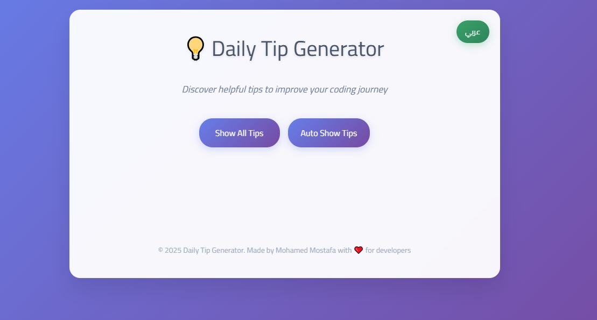

# 

# Tip Generator Application

This project is a bilingual tip generator application that supports both Arabic and English languages. It allows users to toggle between languages dynamically, view tips in the selected language, and even display tips automatically with a countdown timer.

## Features

- **Bilingual Support**: Toggle between Arabic and English languages.
- **RTL Support**: Proper alignment for Arabic text.
- **Dynamic Countdown**: Auto tips with a countdown timer.
- **Bug-Free Auto Tips**: Seamless language updates during auto tips mode.

## Files

- `1to4_task.js`: Contains JavaScript code for solving tasks 1 to 4.
- `index.html`: Main file for the tip generator application (for solving task 5).

## How to Use

1. Open `index.html` in a browser.
2. Use the buttons to:
   - Show a random tip.
   - Start auto tips with a countdown.
   - Stop auto tips.
   - Toggle between Arabic and English languages.

## Development Notes

- The application uses JavaScript for dynamic DOM updates and event handling.
- CSS ensures proper styling and RTL support.
- HTML provides the structure for the application.

## Future Enhancements

- Add more tips to the generator.
- Improve performance for rapid language switching.
- Enhance UI/UX for better user experience.

## Screenshot

